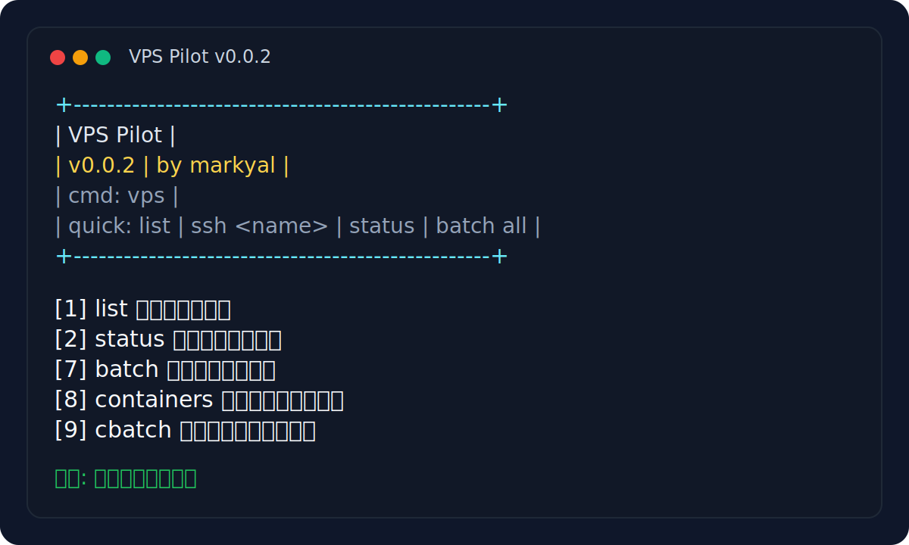
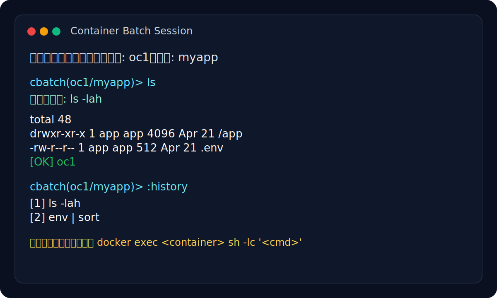

# VPS Pilot

[](https://github.com/maya1900/vps-pilot/releases)
[](./LICENSE)
[](https://github.com/maya1900/vps-pilot/stargazers)
[](./README.md)
[](./vps)

多台 VPS 的本地统一控制工具。

- 版本：`v0.1.0`
- 作者：`markyal`
- 主命令：`vps`

`VPS Pilot` 面向需要在本机统一管理多台 VPS 的场景，提供服务器列表管理、批量命令执行、基础巡检、容器查看、容器内批量命令会话等能力。项目以单文件脚本为核心，尽量降低依赖，适合个人运维、小规模节点管理和日常巡检使用。

---

## 项目说明

本项目定位为本地命令行工具，主要解决以下问题：

- 统一管理多台 VPS 的连接信息
- 通过一个入口完成登录、巡检、批量执行、容器查看等常见操作
- 减少重复输入长 SSH 命令与 Docker 命令的负担
- 提供适合中文使用习惯的交互提示与菜单入口

本项目默认运行在本地终端环境，所有操作均基于 SSH 到目标主机执行，请在确认目标主机、用户和权限配置正确后使用。

---

## 界面截图

以下截图为项目当前命令行交互示意：

### 主菜单



### 容器批量会话



---

## 主要特性

### 核心能力

- 多台 VPS 统一纳管
- SSH 登录与基础连接封装
- VS Code Remote-SSH 远程目录打开
- 批量命令执行与结果汇总
- 状态查看与基础巡检
- 报错上下文采集与诊断分析
- 容器列表查看
- 容器内批量命令会话

### 运维增强

- 支持串行与并发执行
- 批量任务失败不中断，并在结束后输出汇总结果
- SSH 默认带连接超时与保活配置
- 公钥分发支持自动去重
- 配置文件支持合法性校验

### 交互体验

- 中文说明与提示信息
- 菜单入口与直接命令并存
- 批量命令会话支持历史记录、快捷词、命令重跑
- 容器会话支持容器列表选择，减少记忆容器名的负担
- AI 诊断支持 OpenAI 兼容接口

---

## 快速开始

推荐按以下顺序完成初始化：

1. 拉取项目代码
2. 安装与运行
3. 编写服务器配置
4. 开始使用命令或菜单

### 第一步：拉取项目代码

```bash
git clone https://github.com/maya1900/vps-pilot.git
cd vps-pilot
```

### 第二步：安装与运行

macOS / Linux：

```bash
chmod +x "./vps" "./vpsctl"
./vps version
```

Windows：

```powershell
powershell -ExecutionPolicy Bypass -File .\vps.ps1 version
```

### 第三步：编写服务器配置

复制示例配置：

```bash
cp "./servers.example.conf" "./servers.conf"
```

编辑 `servers.conf`，填入你的服务器信息：

```text
名称|用户|主机/IP|端口|私钥路径
oc1|root|192.168.1.10|22|~/.ssh/id_ed25519
oc2|root|192.168.1.11|22|-
```

字段说明：

- `名称`：本地识别名，后续通过 `vps ssh <name>` 等命令使用
- `用户`：SSH 登录用户
- `主机/IP`：公网 IP、内网 IP 或域名
- `端口`：SSH 端口，默认一般为 `22`
- `私钥路径`：SSH 私钥路径；若暂时未知，可填写 `-`

建议先执行一次配置校验：

```bash
vps validate
```

如果远程主机还没有配置免密登录，建议在配置完成后同步 SSH 公钥。

请先确认本机已有 SSH 公钥，例如：

```bash
~/.ssh/id_ed25519.pub
```

然后逐台同步：

```bash
vps copy-key oc1
vps copy-key oc2
```

同步完成后，可优先测试 SSH 登录：

```bash
vps ssh oc1
```

### 第四步：开始使用

```bash
vps
vps list
vps status
vps batch all
```

---

## 安装与运行

### macOS / Linux

给予执行权限：

```bash
chmod +x "./vps" "./vpsctl"
```

如果当前目录就是项目目录，可以直接运行：

```bash
./vps
./vps list
```

如需在任意目录运行：

```bash
mkdir -p "$HOME/.local/bin"
ln -sfn "$(pwd)/vps" "$HOME/.local/bin/vps"
```

前提：

- `~/.local/bin` 已经在你的 `PATH` 中
- 如果项目目录被移动了，需要重新建立链接

### Windows

- 推荐通过 `Git Bash` 或 `WSL` 使用本项目
- 项目已内置 Windows 包装器：
  - `vps.cmd`
  - `vps.ps1`
- 在 `cmd` / `PowerShell` 中运行时，它们会自动尝试调用 `bash`

临时运行：

```bash
bash ./vps
```

如果通过原生 `cmd` / `PowerShell` 使用，并希望任意目录直接输入 `vps`，需要将项目目录加入 `PATH`，或者把 `vps.cmd` / `vps.ps1` 放到已在 `PATH` 的目录。

---

## 命令总览

### 常用命令

```bash
vps list
vps ssh <name>
vps code <name> [path] [--backup]
vps backup <name> <path>
vps ssh-config sync
vps status [name|all] [--parallel]
vps check [name|all] [--parallel]
vps doctor <name> [service|container]
vps batch <name|all> [--parallel]
vps containers <name>
vps cbatch <name> [container]
vps run <name|all> [--parallel] -- <command>
vps update [name|all] [--parallel]
vps upgrade [name|all] [--parallel]
vps reboot [name|all]
vps copy-key <name>
vps validate
vps version
vps help
```

### 命令说明

- `list`：查看服务器列表
- `ssh`：登录指定服务器
- `code`：用 VS Code 打开远程目录，可选打开前先备份
- `backup`：先备份远程文件或目录
- `ssh-config`：同步本机 `~/.ssh/config`，方便 Remote-SSH 使用
- `status`：查看服务器状态；`all` 为简洁汇总，单机时输出更详细的系统信息
- `check`：执行基础巡检，检查磁盘、内存、服务等明显异常
- `doctor`：采集系统、服务、容器报错信息，并输出诊断结果
- `batch`：进入批量命令会话，连续执行多条命令
- `containers`：列出指定服务器上的容器
- `cbatch`：进入容器批量命令会话
- `run`：执行单条批量命令
- `update`：刷新软件包索引
- `upgrade`：升级系统软件包
- `reboot`：重启主机
- `copy-key`：将本机公钥写入远程主机
- `validate`：校验配置文件
- `version`：查看版本与作者信息

---

## 配置说明

### 配置文件

默认配置文件路径：

```bash
./servers.conf
```

如需指定其它配置文件，可通过环境变量覆盖：

```bash
VPSCTL_CONFIG=/path/to/servers.conf vps list
```

可选环境变量：

```bash
VPSCTL_SSH_CONFIG_FILE=~/.ssh/config
VPSCTL_CODE_BIN=code
VPSCTL_AI_API_KEY=your_api_key
VPSCTL_AI_MODEL=gpt-4o-mini
VPSCTL_AI_API_URL=https://api.openai.com/v1/chat/completions
```

说明：

- 如果 `code` 不在全局 `PATH` 里，脚本会继续尝试常见的 macOS 安装路径
- 也可以手动指定：

```bash
VPSCTL_CODE_BIN="/Applications/Visual Studio Code.app/Contents/Resources/app/bin/code" vps code oc1
```

### 示例配置

- [servers.example.conf](./servers.example.conf)
- `servers.conf`：你的本地实际配置文件，需要自行创建，不会进入仓库

注意：真实 `servers.conf` 已被 `.gitignore` 忽略，默认不会进入仓库。

---

## 使用示例

### 查看服务器列表

```bash
vps list
```

### 登录某一台服务器

```bash
vps ssh oc1
```

### 查看所有服务器状态

```bash
vps status
vps status --parallel
```

### 查看单台机器详细状态

```bash
vps status oc1
```

说明：

- `vps status` 或 `vps status all` 适合批量巡检
- `vps status oc1` 适合单机深看，会展示主机、系统、CPU、内存、磁盘、网络、运营商、时间、运行时长等信息

### 执行基础巡检

```bash
vps check
```

### 在 VS Code 中打开远程目录

```bash
vps ssh-config sync
vps code oc1
vps code oc1 /home
vps code oc1 /opt/app
vps code oc1 etc
vps code oc1 /etc/nginx --backup
```

路径说明：

- 不传路径时，默认打开远程登录用户的家目录
- 例如：`root -> /root`，`ubuntu -> /home/ubuntu`，`opc -> /home/opc`
- 传绝对路径时，直接打开对应目录，例如 `/home`、`/opt/app`
- 也支持几个常用短写：`home`、`etc`、`var`、`opt`、`srv`、`usr`、`/`

### 诊断服务或容器问题

```bash
vps doctor oc1
vps doctor oc1 nginx
vps doctor oc1 my-container
```

### 批量执行命令

```bash
vps run all -- docker ps
vps run all --parallel -- docker ps
```

### 刷新与升级系统包

```bash
vps update
vps upgrade
```

### 分发公钥

```bash
vps copy-key oc1
```

### 先备份再改远程文件

```bash
vps backup oc1 /etc/nginx
vps backup oc1 /opt/app/.env
vps code oc1 /etc/nginx --backup
```

说明：

- Remote-SSH 保存时会直接修改远程文件
- 对 `/etc`、`/opt`、`/var` 这类目录，建议先备份再编辑
- `backup` 会把备份放到远程 `~/.vps-pilot/backups/` 下

---

## 批量命令会话

批量命令会话适合连续执行多条命令，而不是每次都重复输入 `vps run`。

进入会话：

```bash
vps batch all
```

会话中可连续执行：

```bash
docker ps
systemctl status nginx --no-pager
cd /opt/app && git pull && docker compose up -d
```

### 会话辅助命令

```bash
:history
:shortcuts
!!
!3
:q
```

说明如下：

- `:history`：查看当前会话历史
- `:shortcuts`：查看快捷词
- `!!`：重跑上一条命令
- `!3`：重跑第 3 条命令
- `:q`：退出会话

### 宿主机会话快捷词

```bash
ps
nginx
docker
disk
mem
ports
restart-nginx
restart-docker
```

---

## 容器批量命令会话

容器会话用于在指定服务器的某个容器内部，连续执行命令。

### 方式一：已知容器名

```bash
vps cbatch oc1 myapp
```

### 方式二：忘记容器名

先查看容器：

```bash
vps containers oc1
```

或者直接：

```bash
vps cbatch oc1
```

此时脚本会先列出容器，支持输入：

- 容器序号
- 容器名

### 容器会话执行方式

容器会话中的每一条命令，都会自动包装为：

```bash
docker exec <container> sh -lc '<你的命令>'
```

例如：

```bash
pwd
ls
env
ps
```

### 容器会话快捷词

```bash
ps
ls
env
pwd
ports
restart
```

---

## 菜单模式

直接输入：

```bash
vps
```

即可进入菜单模式。

菜单适合以下场景：

- 不想记完整命令
- 只想快速查看状态、容器列表、执行常见操作
- 需要通过交互方式选择服务器或容器

查看类菜单项输出完成后，按任意键即可返回菜单。

---

## 开发规划

- 下一版本方向见 [ROADMAP.md](./ROADMAP.md)
- 设计与分期实现说明见 [docs/development-plan.md](./docs/development-plan.md)

当前已落地的一期能力：

- `ssh-config sync`
- `code <name> [path] [--backup]`
- `backup <name> <path>`
- `doctor <name> [service|container]`

下一步重点方向：

- 对话式 `vps chat <name>` 运维助手
- 远程目录挂载能力
- 诊断结果导出与复盘

---

## 版本信息

查看当前版本：

```bash
vps version
```

当前版本信息：

- 项目名：`VPS Pilot`
- 版本：`v0.1.0`
- 作者：`markyal`

---

## 项目结构

当前核心文件如下：

- [vps](./vps)：主脚本
- [vpsctl](./vpsctl)：兼容入口
- [vps.cmd](./vps.cmd)：Windows CMD 包装器
- [vps.ps1](./vps.ps1)：Windows PowerShell 包装器
- [README.md](./README.md)：项目说明
- [CHANGELOG.md](./CHANGELOG.md)：版本变更记录
- [ROADMAP.md](./ROADMAP.md)：下一版本开发清单
- [docs/development-plan.md](./docs/development-plan.md)：开发设计文档
- [servers.example.conf](./servers.example.conf)：示例配置
- `servers.conf`：本地实际配置，不纳入仓库
- [docs/screenshots](./docs/screenshots)：README 截图资源
- [.gitignore](./.gitignore)：仓库忽略规则
- [LICENSE](./LICENSE)：开源许可证

---

## 发布说明

仓库建议提交以下文件：

- `vps`
- `vpsctl`
- `vps.cmd`
- `vps.ps1`
- `README.md`
- `CHANGELOG.md`
- `ROADMAP.md`
- `LICENSE`
- `servers.example.conf`
- `.gitignore`

不建议提交：

- `servers.conf`
- `.vps_batch_history`

这样可以避免将真实服务器信息、本地操作历史等内容带入公开仓库。

---

## 安全提示

- 请确认目标主机、SSH 用户和密钥来源可信
- 批量执行命令前，建议先对单台主机验证结果
- `upgrade`、`reboot` 等命令具有实际影响，请谨慎使用
- 若使用公开仓库，请勿提交真实 IP、私钥路径及敏感运维习惯配置
