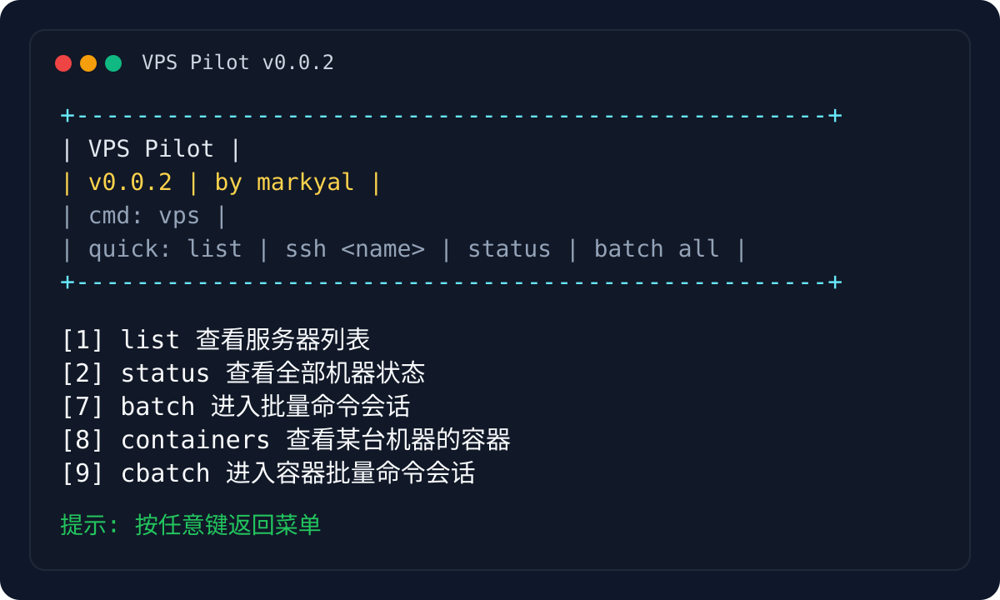
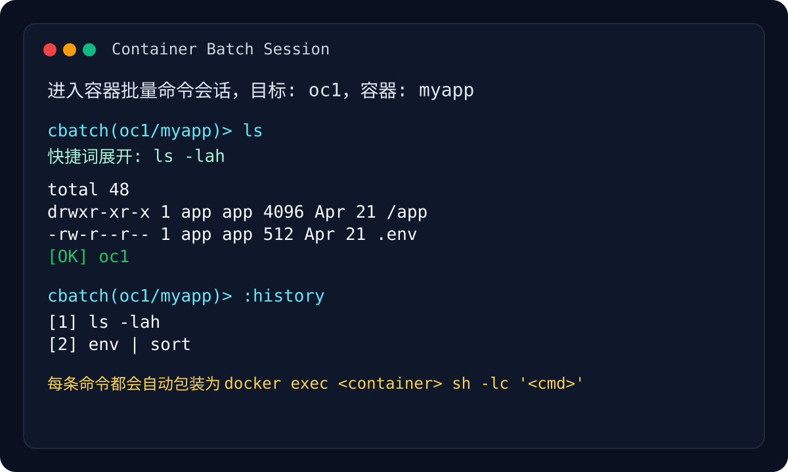

# VPS Pilot

[](https://github.com/maya1900/vps-pilot/releases)
[](./LICENSE)
[](https://github.com/maya1900/vps-pilot/stargazers)
[](./vps)

VPS Pilot 是一个本地命令行工具，用来在一台电脑上统一管理多台 VPS。

它的核心目标很简单：把常用的 SSH 登录、批量命令、状态查看、基础巡检、Docker 容器查看、容器内命令会话、VS Code Remote-SSH 打开目录等操作收进一个 `vps` 命令里。

- 当前版本：`v0.2.0`
- 作者：`markyal`
- 主入口：`vps`
- 兼容入口：`vpsctl`

---

## 功能范围

当前项目已经支持：

- 本地维护服务器配置：`list`、`add`、`del`、`password`、`validate`
- SSH 登录：`ssh <name>`
- SFTP 打开：`sftp <name>`，通过 Transmit 打开连接
- SSH 配置同步：`ssh-config sync` / `ssh-config show`
- VS Code Remote-SSH 打开远程目录：`code <name> [path]`
- 远程文件或目录备份：`backup <name> <path>`
- 单台或多台执行命令：`run <name|all> [--parallel] -- <command>`
- 状态查看：`status [name|all] [--parallel]`
- 基础巡检：`check [name|all] [--parallel]`
- 系统包刷新与升级：`update`、`upgrade`
- 主机重启：`reboot`
- SSH 公钥分发：`copy-key <name>`
- 批量命令会话：`batch <name|all> [--parallel]`
- Docker 容器列表：`containers <name>`，别名 `docker <name>`
- 容器内批量命令会话：`cbatch <name> [container]`
- 诊断信息采集和规则分析：`doctor <name> [subject]`
- 可选 OpenAI 兼容接口 AI 分析：通过环境变量开启
- 交互菜单：直接执行 `vps` 或 `vps menu`

项目没有内置 Web 面板、远程目录挂载、插件系统、分组标签、巡检报告导出、对话式运维助手等能力。相关想法如果存在，只属于规划文档，不代表当前版本可用。

---

## 截图

### 主菜单



### 容器批量会话



---

## 环境要求

本机需要：

- Bash
- OpenSSH 客户端：`ssh`
- 可选：`expect`，用于保存密码后的自动输入
- 可选：`curl` 和 `python3`，用于 `doctor` 的 AI 分析
- 可选：VS Code 命令行工具 `code`，用于 `vps code`
- 可选：Transmit，`vps sftp` 会通过系统 `open` 打开 `sftp://...` 地址，主要适用于 macOS

远程主机按实际命令需要提供：

- Linux 常见工具：`df`、`free`、`ps`、`systemctl`、`journalctl` 等
- Docker 相关命令只在远程主机安装 Docker 时可用
- `update` / `upgrade` / `reboot` 会执行 `sudo -n` 命令，远程用户需要配置免密 sudo

Windows 可以通过 `vps.cmd` 或 `vps.ps1` 调用，但仍然依赖 Git Bash 或 WSL 提供 Bash 环境。

---

## 快速开始

### 1. 获取代码

```bash
git clone https://github.com/maya1900/vps-pilot.git
cd vps-pilot
```

### 2. 赋予执行权限

```bash
chmod +x "./vps" "./vpsctl"
```

### 3. 创建配置文件

```bash
cp "./servers.example.conf" "./servers.conf"
```

编辑 `servers.conf`：

```text
# 名称|用户|主机/IP|端口|私钥路径|密码
oc1|root|1.2.3.4|22|~/.ssh/id_ed25519|
oc2|ubuntu|example.com|2222|-|
```

字段说明：

- `名称`：本地别名，后续命令用它选择服务器
- `用户`：SSH 登录用户
- `主机/IP`：服务器 IP 或域名
- `端口`：SSH 端口，默认通常是 `22`
- `私钥路径`：私钥文件路径；暂不指定时填 `-`
- `密码`：可选；建议用 `vps password <name>` 交互隐藏输入，避免明文进入 shell 历史

配置支持旧版 5 段格式：`名称|用户|主机/IP|端口|私钥路径`。

### 4. 校验配置

```bash
./vps validate
```

### 5. 查看和登录

```bash
./vps list
./vps ssh oc1
```

---

## 安装到 PATH

如果希望在任意目录直接输入 `vps`：

```bash
mkdir -p "$HOME/.local/bin"
ln -sfn "$(pwd)/vps" "$HOME/.local/bin/vps"
ln -sfn "$(pwd)/vpsctl" "$HOME/.local/bin/vpsctl"
```

确认 `$HOME/.local/bin` 已经在 `PATH` 中。

Windows 下可以直接调用：

```powershell
powershell -ExecutionPolicy Bypass -File .\vps.ps1 version
```

或在 `cmd` 中：

```bat
vps.cmd version
```

---

## 配置文件

默认读取项目目录下的：

```bash
./servers.conf
```

可以通过环境变量指定其它配置文件：

```bash
VPSCTL_CONFIG="/path/to/servers.conf" vps list
```

`servers.conf` 会保存真实服务器信息和可选密码，默认不应提交到公开仓库。

---

## 命令总览

```bash
vps list
vps add [name user host [port] [key] [password]]
vps del <name> [--yes]
vps password <name> [password]
vps ssh <name>
vps sftp <name>
vps code <name> [path] [--backup]
vps backup <name> <path>
vps ssh-config [sync|show] [--file path]
vps status [name|all] [--parallel]
vps check [name|all] [--parallel]
vps doctor <name> [subject]
vps batch <name|all> [--parallel]
vps containers <name>
vps docker <name>
vps cbatch <name> [container]
vps run <name|all> [--parallel] -- <command>
vps update [name|all] [--parallel]
vps upgrade [name|all] [--parallel]
vps reboot [name|all]
vps copy-key <name>
vps validate
vps version
vps menu
vps help
```

常用别名：

```text
ls -> list
new -> add
delete/remove/rm -> del
passwd/pass -> password
login -> ssh
transmit -> sftp
vscode -> code
snapshot -> backup
sshconfig -> ssh-config
exec -> run
diag/diagnose -> doctor
console -> batch
container-list -> containers
container-batch -> cbatch
copykey/copy-k/copyk -> copy-key
```

---

## 服务器配置管理

交互式新增：

```bash
vps add
```

命令式新增：

```bash
vps add oc1 root 1.2.3.4
vps add oc2 ubuntu example.com 2222 ~/.ssh/id_ed25519
```

删除配置：

```bash
vps del oc1
vps del oc1 --yes
```

更新密码：

```bash
vps password yy1
```

`del` 只修改本地 `servers.conf`，不会删除远程服务器。
`vps add ... [password]` 和 `vps password <name> <password>` 仍兼容命令行传密码，但这会暴露在 shell 历史和进程列表里，不建议使用。

---

## 登录与认证

登录服务器：

```bash
vps ssh oc1
```

分发本机公钥：

```bash
vps copy-key oc1
```

`copy-key` 会把本机公钥写入远程 `~/.ssh/authorized_keys`，并自动去重。成功后会把该服务器配置里的密码清空，改用私钥路径。

密码登录说明：

- 交互式 `vps ssh` 使用 OpenSSH askpass 自动输入密码
- `run`、`status`、`check`、`copy-key` 等远程命令使用 `expect` 自动输入密码
- 仅密码登录不支持 `--parallel`，需要先执行 `copy-key` 改成密钥登录

---

## SSH Config 与 VS Code

同步 `~/.ssh/config`：

```bash
vps ssh-config sync
```

预览将写入的配置：

```bash
vps ssh-config show
```

指定目标文件：

```bash
vps ssh-config sync --file ~/.ssh/config
```

用 VS Code Remote-SSH 打开远程目录：

```bash
vps code oc1
vps code oc1 /opt/app
vps code oc1 etc
vps code oc1 /etc/nginx --backup
```

路径规则：

- 不传路径时打开远程登录用户的家目录
- 绝对路径会原样使用，例如 `/opt/app`
- `~` 和 `~/path` 会解析为远程用户家目录
- 支持短写：`home`、`root`、`etc`、`var`、`opt`、`srv`、`usr`、`/`、`rootfs`、`fs`

`vps code` 会先同步 SSH config，再调用本机 VS Code 命令行工具。

---

## SFTP

通过 Transmit 打开 SFTP：

```bash
vps sftp oc1
vps transmit oc1
```

该命令会打开 `sftp://user@host:port` 地址。私钥、收藏夹等高级连接设置由 Transmit 自身处理，实际依赖系统 `open`，主要适用于 macOS。

---

## 远程备份

备份远程文件或目录：

```bash
vps backup oc1 /etc/nginx
vps backup oc1 /opt/app/.env
```

备份保存到远程主机：

```text
~/.vps-pilot/backups/
```

目录会打成 `tar.gz`，文件会复制到带时间戳的目录里。

为避免误备份超大目录，`backup` 会拒绝直接备份 `/`、`/root`、`/home`。

---

## 批量执行

对所有服务器串行执行：

```bash
vps run all -- uptime
```

对所有服务器并发执行：

```bash
vps run all --parallel -- docker ps
```

对单台执行：

```bash
vps run oc1 -- df -h
```

`status`、`check`、`update`、`upgrade` 也支持 `[name|all] [--parallel]`：

```bash
vps status
vps status oc1
vps check all --parallel
vps update all
vps upgrade oc1
```

重启需要输入 `YES` 确认：

```bash
vps reboot oc1
vps reboot all
```

---

## 状态、巡检与诊断

状态查看：

```bash
vps status
vps status oc1
```

`vps status all` 输出适合批量扫一遍。`vps status <name>` 会输出更详细的系统、CPU、内存、磁盘、流量、网络、定位和运行时间信息。

基础巡检：

```bash
vps check
vps check oc1
```

巡检会检查：

- 当前用户和 sudo 状态
- 根分区使用率
- 可用内存
- 常见服务状态：`sshd`、`ssh`、`nginx`、`docker`、`cron`

诊断采集：

```bash
vps doctor oc1
vps doctor oc1 nginx
vps doctor oc1 my-container
```

`doctor` 会采集基础信息、最近错误日志、监听端口、Docker 概览，并对指定 systemd 服务或 Docker 容器补充状态和日志。随后会做本地规则分析。

可选 AI 分析环境变量：

```bash
export VPSCTL_AI_API_KEY="your_api_key"
export VPSCTL_AI_MODEL="gpt-4o-mini"
export VPSCTL_AI_API_URL="https://api.openai.com/v1/chat/completions"
```

启用 AI 分析后，诊断报告会发送到 `VPSCTL_AI_API_URL`。交互模式会要求确认；非交互自动化可设置 `VPSCTL_AI_DOCTOR_ASSUME_YES=1`。未设置 AI 环境变量时，`doctor` 仍会输出原始诊断信息和本地规则分析。

---

## 批量命令会话

进入宿主机批量会话：

```bash
vps batch all
vps batch all --parallel
vps batch oc1
```

会话中直接输入远程命令：

```bash
docker ps
systemctl status nginx --no-pager
cd /opt/app && git pull && docker compose up -d
```

会话辅助命令：

```text
:help       查看说明
:history    查看本次会话历史
:shortcuts  查看快捷词
!!          重跑上一条命令
!3          重跑第 3 条历史命令
:q          退出
```

宿主机会话快捷词：

```text
ps             -> docker ps
nginx          -> systemctl status nginx --no-pager
docker         -> systemctl status docker --no-pager
disk           -> df -h
mem            -> free -h
ports          -> ss -tulpn
restart-nginx  -> sudo -n systemctl restart nginx
restart-docker -> sudo -n systemctl restart docker
```

---

## Docker 容器命令

列出某台服务器上的容器：

```bash
vps containers oc1
vps docker oc1
```

进入容器批量会话：

```bash
vps cbatch oc1 myapp
```

不传容器名时，交互终端会先列出容器并让你选择：

```bash
vps cbatch oc1
```

容器会话里的命令会被包装为：

```bash
docker exec <container> sh -lc '<command>'
```

容器会话快捷词：

```text
ps      -> ps
ls      -> ls -lah
env     -> env | sort
pwd     -> pwd
ports   -> ss -tulpn || netstat -tulpn
restart -> supervisorctl restart all || s6-svc -r /var/run/s6/services/* || true
```

---

## 菜单模式

直接运行：

```bash
vps
```

或：

```bash
vps menu
```

菜单提供列表、添加、删除、状态、巡检、更新、升级、登录、SFTP、批量会话、VS Code 打开目录、批量执行、重启、配置校验和版本信息入口。

---

## 环境变量

```bash
VPSCTL_CONFIG=/path/to/servers.conf
VPSCTL_STATE_DIR=~/.config/vps-pilot
VPSCTL_HISTORY_FILE=/path/to/.vps_batch_history
VPSCTL_SSH_CONFIG_FILE=~/.ssh/config
VPSCTL_SSH_STRICT_HOST_KEY_CHECKING=accept-new
VPSCTL_SSH_CONTROL=auto
VPSCTL_SSH_CONTROL_DIR=~/.config/vps-pilot/ssh-control
VPSCTL_SSH_CONTROL_PERSIST=10m
VPSCTL_PARALLEL_LIMIT=8
VPSCTL_CODE_BIN=code
VPSCTL_AI_API_KEY=your_api_key
VPSCTL_AI_MODEL=gpt-4o-mini
VPSCTL_AI_API_URL=https://api.openai.com/v1/chat/completions
VPSCTL_AI_DOCTOR_ASSUME_YES=1
VPSCTL_AI_DOCTOR_REDACT=1
```

---

## 项目结构

```text
.
├── vps                    # 主脚本
├── vpsctl                 # 兼容入口，转发到 vps
├── vps.cmd                # Windows CMD 包装器
├── vps.ps1                # Windows PowerShell 包装器
├── servers.example.conf   # 示例配置
├── README.md              # 项目说明
├── CHANGELOG.md           # 版本变更
├── ROADMAP.md             # 规划记录，不代表当前能力
├── LICENSE
└── docs/
    ├── development-plan.md
    └── screenshots/
```

本地运行后可能出现：

```text
servers.conf         # 本地真实服务器配置，不应提交
.vps_batch_history   # 批量会话历史
```

---

## 安全提示

- 不要把真实 `servers.conf` 提交到公开仓库
- 保存密码时，确认本机文件权限和使用环境可信
- 批量命令先在单台机器验证，再对 `all` 执行
- `upgrade`、`reboot`、`run all --parallel` 都会真实影响远程主机
- 打开 `/etc`、`/opt`、`/var` 等目录前，建议先执行 `vps backup`

---

## 许可证

[MIT License](./LICENSE)
